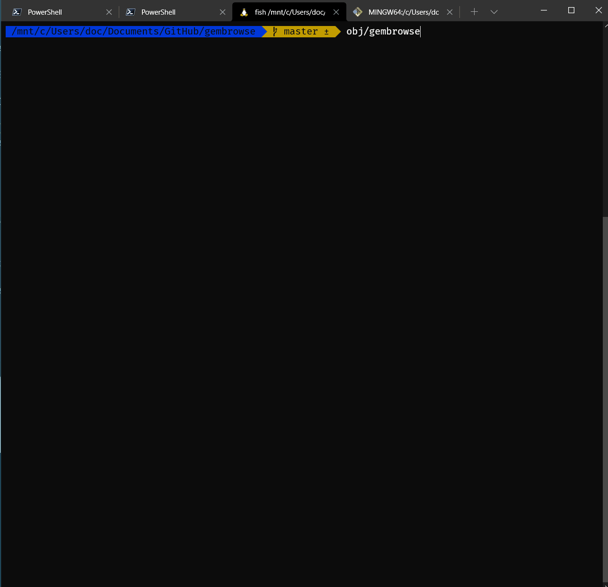

# Gembrowse: A Gemini browser for people with kids

This is a WORK IN PROGRESS! Many features are still unimplemented (or poorly
implemented).

# Features

* It's just one file.

* Written in Ada for security and safety.

* Keyboard and Mouse Friendly

Hover over any button to see the keyboard shortcut. They should be pretty
close to what you are used to in Chrome or Firefox.

# Installation

Just copy the binary somewhere and run it!

Having said that, you'll probably want a good font installed with emojis
and comprehensive Unicode coverage.

I like Nerd Fonts for my terminal:

https://www.nerdfonts.com/

Gembrowse makes use of emojis, but no Font Awesome icons or Powerline symbols
or anything like that.

## Bookmarks File

Gemini will look for a file called `.gembrowse-bookmarks.gmi` in your home
folder. You can specify a different bookmarks folder with the `-b` option
if you want to keep your bookmarks in a Dropbox folder or Git dotfiles repo
or something like that to sync across devices.

# Build Instructions

## Build Requirements

Gembrowse is intentionally built with minimal requirements. Aside from libc and
associated system libraries like `librt` and `libpthread`, everything is written
from scratch with the exception of TLS, which comes from the LibreSSL project.
This is statically linked so Gembrowse can be distributed as a single binary.

This project _does_ make use of Ada 202X features, so you'll probably need 
GNAT 2021 to build it.

## LibreSSL
  
Follow the build instructions or just download the binaries. Gembrowse
statically links `libtls` and `libcrypto`. The Gembrowse project file will
look for `libcrypto.a` and `libtls.a` in the `lib/` folder (alongside `src/`)

Once that's done, just run `make` in the top level folder.